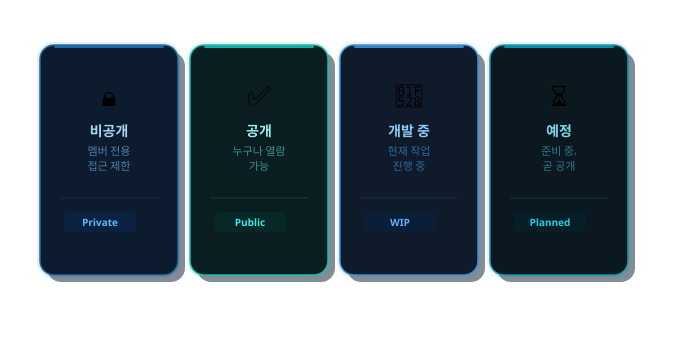

<h1 align="center">⚔️ 기네스그룹 (Guinness Group)</h1>
<h3 align="center">"현실과 가상의 경계에서, 우리는 새로운 세계를 만듭니다."</h3>

기네스그룹은 마인크래프트 기반의 커뮤니티 서버 프로젝트입니다.

현재 소드아트온라인(Sword Art Online) 테마를 중심으로 서버를 개발하고 있으며, 
플레이어들에게 몰입감 있는 가상 세계 경험을 제공하는 것을 목표로 합니다.

---

## 커뮤니티

| 플랫폼 | 링크 |
|--------|:------:|
| 💬 Discord | [Link](https://discord.gg/5XDjHNWn8Y) |
| 🌿 Web | ⏳ 예정 |

기네스그룹의 개발에 참여하고 싶으신 분은 Discord를 통해 문의해주세요.

---

#### 📦 저장소 목록

| 저장소 | 설명 | 상태 |
|--------|------|------|
| `ServerLog` | 플레이어의 각종 활동 및 서버 상태를 자동으로 로그로 남기는 서버 플러그인 | [✅ Public](https://github.com/GuinnessGroup/ServerLog) |
